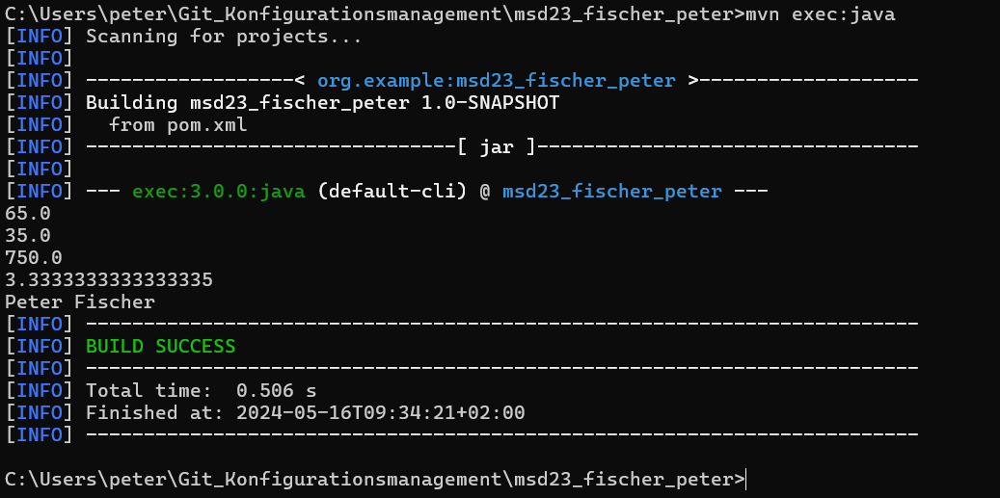

# Exercise 3 

Im Projekt wurde ein neuer Ordner namens target erstellt, in welchem sich weitere verschachtelte Ordener befinden, welche wie unser Package Struktur aufgebaut sind. Am Ende dieser Ordner befinden sich die Main Klasse und die Calculator Klasse. Zu diesen Klassen gibt IntelliJ die Information, dass es sich um die dekompilierten .class Files handelt und um welche Version des Bytecodes es sich handelt. Weiters wurden die Ordner generated-sources und annotations erstellt.

## Image 1

## Image 2

## Image 3

## Image 4

